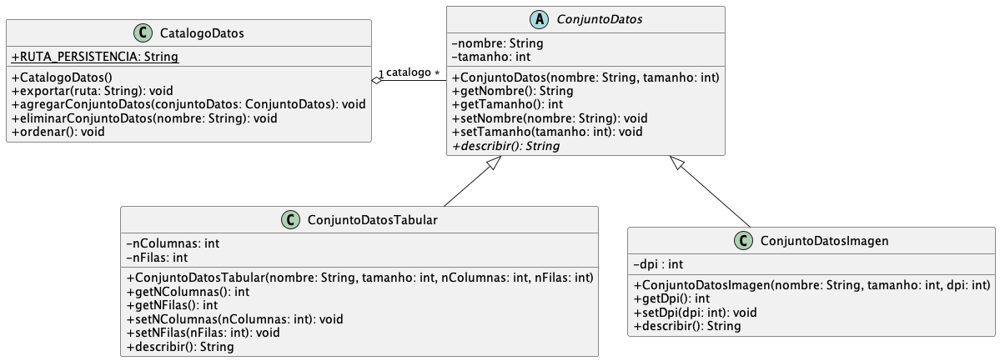

# Solución del Parcial 3 2023-1

## 1. Conceptos (20 puntos)

## Preguntas de selección

1. La herencia permite que una clase adquiera los atributos y métodos de otra clase.
    - a) Verdadero
    - b) Falso
   

      
Ver respuesta

      a) Verdadero
   
 

2. El polimorfismo permite que un objeto se comporte de diferentes formas según el contexto.
    - a) Verdadero
    - b) Falso
   

      
Ver respuesta

      a) Verdadero
   
 

3. En Java, una clase puede heredar de múltiples clases al mismo tiempo.
    - a) Verdadero
    - b) Falso
   

      
Ver respuesta

      b) Falso
   
 

4. El método `super()` se utiliza en una clase hija para llamar al constructor de la clase padre.
    - a) Verdadero
    - b) Falso
   

      
Ver respuesta

      a) Verdadero
   
 

5. Una clase abstracta puede heredar de otra clase abstracta.
    - a) Verdadero
    - b) Falso
   

      
Ver respuesta

      a) Verdadero
   
 

6. ¿Cuál de las siguientes opciones describe correctamente la herencia en programación orientada a objetos?
    - a) La capacidad de una clase de heredar propiedades y métodos de otra clase.
    - b) El proceso de encapsular datos y comportamientos en un solo objeto.
    - c) La técnica de ocultar detalles internos de un objeto y mostrar solo la interfaz.
    - d) La capacidad de un objeto de ser tratado como uno de varios tipos posibles.
   

      
Ver respuesta

      a) La capacidad de una clase de heredar propiedades y métodos de otra clase.
   
 

7. ¿Cuál de las siguientes opciones describe mejor el polimorfismo en Java?
    - a) La capacidad de una clase de heredar propiedades y métodos de otra clase.
    - b) El proceso de encapsular datos y comportamientos en un solo objeto.
    - c) La técnica de ocultar detalles internos de un objeto y mostrar solo la interfaz.
    - d) La capacidad de un objeto de ser tratado como uno de varios tipos posibles.
   

      
Ver respuesta

      d) La capacidad de un objeto de ser tratado como uno de varios tipos posibles.
   
 

8. ¿Cuál de las siguientes afirmaciones sobre las clases abstractas es correcta?
    - a) Se pueden instanciar directamente.
    - b) Pueden heredar de múltiples clases al mismo tiempo.
    - c) Pueden contener implementaciones completas de todos sus métodos.
    - d) Se utilizan como plantillas para crear subclases concretas.
   

      
Ver respuesta

      d) Se utilizan como plantillas para crear subclases concretas.
   
 

9. ¿Cuál de las siguientes opciones describe mejor el concepto de sobreescritura de métodos en Java?
    - a) La capacidad de una subclase de proporcionar una implementación diferente para un método heredado de la clase padre.
    - b) La capacidad de una clase de heredar propiedades y métodos de otra clase.
    - c) La técnica de ocultar detalles internos de un objeto y mostrar solo la interfaz.
    - d) La capacidad de un objeto de ser tratado como uno de varios tipos posibles.
   

      
Ver respuesta

      a) La capacidad de una subclase de proporcionar una implementación diferente para un método heredado de la clase padre.
   
 

10. ¿Cuál de las siguientes afirmaciones sobre las interfaces en Java es correcta?
    - a) Pueden tener atributos y métodos con implementaciones predeterminadas.
    - b) Pueden instanciarse directamente.
    - c) Pueden heredar de otras interfaces y clases.
    - d) Una clase puede implementar múltiples interfaces al mismo tiempo.
   

      
Ver respuesta

      d) Una clase puede implementar múltiples interfaces al mismo tiempo.
   
 

## 2. Conjuntos de datos (80 puntos)
**Por favor lea toda esta sección antes de desarrollarla**

### 2.1. (20 puntos) Definición de clases y atributos

Defina las clases representadas en el siguiente diagrama UML:

Note que los métodos que están escritos en cursiva son abstractos. De estas clases, implemente únicamente los métodos descritos a continuación y asuma que el resto ya está implementado.

### 2.2. (60 puntos) Definición de métodos

Desarrolle los siguientes métodos en las clases definidas anteriormente:

| Clase                 | Puntos | Descripción                                                                                                                                                                                                                                                                                                                                                                 |
|-----------------------|--------|-----------------------------------------------------------------------------------------------------------------------------------------------------------------------------------------------------------------------------------------------------------------------------------------------------------------------------------------------------------------------------|
| `CatalogoDatos`       | 10     | [Un constructor sin parámetros que cargue los conjuntos de datos de un archivo binario](./src/main/java/org/example/models/CatalogoDatos.java#L19). Puede asumir que la ruta del archivo está en la constante `RUTA_ARCHIVO_PERSISTENCIA`.                                                                                                                                  |
| `ConjuntoDatosImagen` | 2.5    | [Sobreescriba el método `describir()`](./src/main/java/org/example/models/conjunto_datos/ConjuntoDatosImagen.java#L24) para que retorne un `String` con el siguiente formato: `Imagen, <nombre>, <tamaño>, DPI:<dpi>`.                                                                                                                                                      |
| `ConjuntoDatosTabular`| 2.5    | [Sobreescriba el método `describir()`](./src/main/java/org/example/models/conjunto_datos/ConjuntoDatosTabular.java#L36) para que retorne un `String` con el siguiente formato: `Tabular, <nombre>, <tamaño>, <Filas>x<Columnas>`.                                                                                                                                           |
| `ConjuntoDatosTabular`| 5      | [Un constructor por parámetros para esta clase](./src/main/java/org/example/models/conjunto_datos/ConjuntoDatosTabular.java#L8).                                                                                                                                                                                                                                            |
| `CatalogoDatos`       | 15     | [Un método `exportar`](./src/main/java/org/example/models/CatalogoDatos.java#L29) que reciba la ruta de un archivo de texto y en este archivo escriba la información de los conjuntos de datos incluidos en el catálogo. Cada línea de este archivo describe a un (y sólo un) conjunto de datos usando el resultado del método `describir`. No debe haber líneas repetidas. |
| `CatalogoDatos`       | 5      | [Un método `agregarConjuntoDatos`](./src/main/java/org/example/models/CatalogoDatos.java#L48) que reciba por parámetro un conjunto de datos y lo agregue a la lista de conjuntos.                                                                                                                                                                                           |
| `CatalogoDatos`       | 5      | [Un método `eliminarConjuntoDatos`](./src/main/java/org/example/models/CatalogoDatos.java#L54) que reciba por parámetro el nombre de un conjunto de datos y lo elimine de la lista de conjuntos. Este método debe lanzar una excepción si no se encuentra un conjunto con este nombre.                                                                                      |
| `CatalogoDatos`       | 15     | [Un método `ordenar`](./src/main/java/org/example/models/CatalogoDatos.java#L80) que ordene la lista de conjuntos de datos según su tamaño y en orden ascendente (de menor a mayor).                                                                                                                                                                                        |

Para cualquiera de estos métodos puede usar métodos desarrollados en otros puntos del parcial. En caso de usar métodos adicionales o auxiliares que no estén incluidos en este enunciado, debe implementarlos completamente.

Puede probar la solución ejecutando el archivo [`Main.java`](./src/main/java/org/example/Main.java).